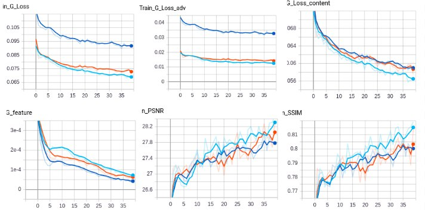
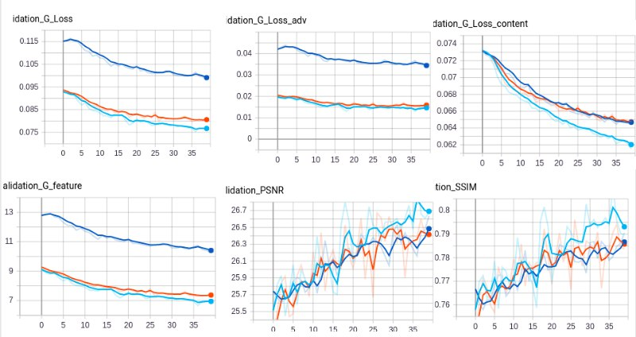
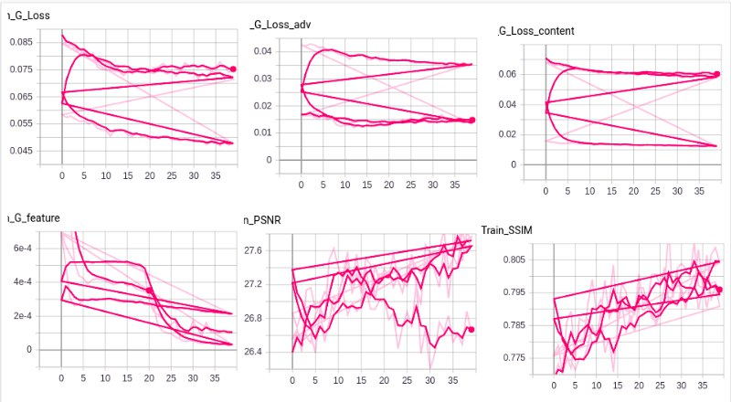
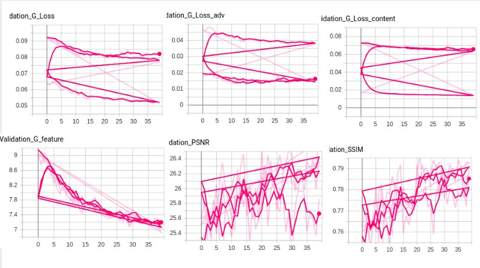

# DeblurGAN-v2: Deblurring (Orders-of-Magnitude) Faster and Better
As I have a limited resources I trained only 40 epochs
## Setup 1
---
warmup_num: 3

model: fpn_mobilenet

batch_size: 4

optimizer: 
    name: adam
    lr: 0.0001

scheduler: No scheduler

## Setup 2
---
warmup_num: 7

model: fpn_mobilenet

num_workers: 4

batch_size: 2

optimizer: 
    name: adam
    lr: 0.0001

scheduler:
    name: linear
    start_epoch: 25
    min_lr: 0.0000001

## Setup 3
---
I changed backbone to inception to check performace

### losses
Yellow - first experiment
Blue - second experiment
Light Blue - third experiment
Train
 
Validation

## Setup 4
---
model: fpn_mobilenet

content_loss: l2

disc_loss: ragan-ls

no scheduler

## Setup 5
---
model: fpn_mobilenet

content_loss: l2

no scheduler

## Setup 6
---
model: fpn_mobilenet

learning rate of 10−3

disc_loss: gan

scheduler:
    name: linear
    start_epoch: 15
    min_lr: 0.0001

### Losses 
I messed it up, all 3 exps was printd to one file
Train
 
Validation

